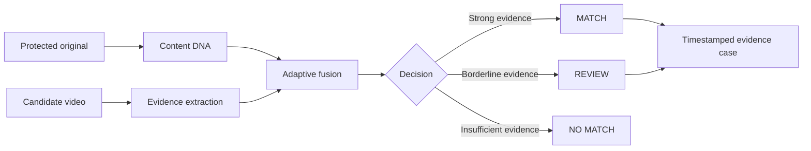

<p align="center">
  
</p>

<h1 align="center">CineShield</h1>

<p align="center">
  <strong>Adaptive Multimodal Verification of Transformed Video Copies</strong>
</p>

<p align="center">
  Final-Year CSE Major Project &nbsp;|&nbsp; Python &nbsp;|&nbsp; FastAPI &nbsp;|&nbsp; OpenCV &nbsp;|&nbsp; Evidence Fusion
</p>

CineShield is a final-year CSE major project that investigates whether **adaptive multimodal evidence fusion** can improve the identification of transformed copies of protected video content over visual-only and temporal-only matching methods.

The prototype compares an original video with candidate videos using visual frame evidence, scene order, temporal consistency, duration, coverage, and supporting page metadata. It produces an explainable technical outcome: `MATCH`, `REVIEW`, or `NO MATCH`. Every action remains human-gated; CineShield prepares evidence and does not make legal decisions or issue takedowns.

## Research Question

> Can adaptive fusion of visual, scene, temporal, OCR/text, audio, and metadata evidence improve transformed-video copy detection compared with conventional single-modality matching, while maintaining practical processing time and computational cost?

## At a Glance

| Area | CineShield approach |
| --- | --- |
| **Input** | An original video and one or more permitted candidate videos |
| **Core idea** | Build a Content DNA profile and verify sustained correspondence across multiple signals |
| **Output** | `MATCH`, `REVIEW`, or `NO MATCH`, with scores, timestamps, and evidence reasoning |
| **Research comparison** | Visual-only baseline vs. temporal-only baseline vs. adaptive fused evidence |
| **Primary users** | Rights teams, content platforms, researchers, and media-review workflows |
| **Boundary** | Evidence support only: no legal decision, automated takedown, access-control bypass, or unauthorized downloading |

## Motivation

Digital video can be altered before being redistributed. Common transformations include re-encoding, cropping, watermarks, resolution changes, subtitle overlays, partial clips, audio modification, screen recording, and timing shifts. A filename or one visually similar frame is not sufficient evidence that two videos are derived from the same underlying work.

CineShield focuses on the verification problem:



## Technical Contribution

The proposed contribution is an **adaptive evidence-fusion strategy**. Instead of assigning every signal the same fixed importance, CineShield raises or reduces signal weights according to observed transformation conditions.

For example, crop and watermark conditions may reduce trust in visual boundary features and raise the importance of scene order and audio evidence. A partial clip may be review-gated even when its local visual similarity is high because source coverage is insufficient.

| Evidence layer | Current technique | Purpose |
| --- | --- | --- |
| Visual | Frame sampling and normalised visual descriptors | Detect visual correspondence despite moderate re-encoding |
| Scene | Ordered scene-transition profile | Test whether the same sequence of content is preserved |
| Temporal | Timeline consistency and matched timestamp patterns | Distinguish a sustained copy from isolated similar frames |
| Audio | Extracted audio fingerprint support in the benchmark pipeline | Improve robustness when visual evidence is degraded |
| OCR/Text | Subtitle and on-screen-text support signals | Corroborate, never independently prove, a match |
| Metadata | Filename, duration, page context, and file metadata | Candidate discovery and supplementary explanation |
| Fusion | Transformation-aware evidence weighting | Produce the final score and decision boundary |

## Handling Redundancy and Latency

### Redundant frames

Long static scenes can produce repetitive evidence. The scanner samples the timeline, builds compact frame descriptors, and de-duplicates near-identical frames before comparison. This reduces processing cost and avoids counting one static shot as many independent confirmations.

### Timing offsets and latency

Candidate copies may include an inserted introduction, a trimmed opening, or a shifted timeline. CineShield compares normalised time positions and scene order rather than requiring frames to occur at exactly the same absolute timestamp. The system reports temporal inconsistency as uncertainty instead of treating it as automatic proof of a mismatch.

## Current Implementation

The repository includes a working local prototype with:

- A FastAPI backend for upload, local scanning, URL-candidate verification, and public discovery requests.
- OpenCV and NumPy media fingerprint extraction for video frames, scene structure, duration, coverage, and temporal evidence.
- An evidence-fusion result with ranked candidates, per-signal scores, decisions, investigator reasoning, and human-review boundaries.
- A frontend dashboard for Content DNA, discovery leads, threat graph visualisation, candidate inspection, and evidence packages.
- A controlled synthetic benchmark engine and a smaller real-media smoke-test pipeline using locally generated permitted videos.
- A public discovery connector for publicly reachable pages and search indexes. Discovery evidence is kept separate from Content DNA verification evidence.

The prototype does **not** claim to scan the entire internet or automatically establish that a website is unlawful. Public search results are candidate leads until permitted media can be fingerprint-verified.

## Prototype Architecture

```text
Browser dashboard
       |
       v
FastAPI backend
       |
       +--> Content registration and local media upload
       |
       +--> Content DNA extraction
       |
       +--> Candidate comparison and adaptive fusion
       |
       +--> Investigation summary and evidence package
       |
       +--> Optional public discovery connector
```

## Evaluation Methodology

The final evaluation will use a controlled, labelled dataset containing:

- Original videos
- Clean and compressed copies
- Cropped and screen-recorded copies
- Resolution and speed-modified copies
- Watermarked videos
- Subtitle or overlay variants
- Audio-modified variants
- Partial clips
- Visually similar but unrelated hard-negative videos

The split must be at the content level: variants of the same original video cannot appear in both calibration and held-out test data.

### Metrics

| Category | Metrics |
| --- | --- |
| Detection quality | Precision, recall, F1-score, false-positive rate, false-negative rate |
| Robustness | Per-transformation recall and Top-k recall where applicable |
| Confidence quality | Calibration error and review-rate analysis |
| Efficiency | Processing latency, throughput, CPU/RAM use, and sampled-frame count |
| Comparison | Visual-only baseline, temporal-only baseline, and adaptive fused model |

The evaluation will explicitly report the trade-off between detection quality, processing time, and computational cost.

## Benchmark Status

The current project includes two reproducible prototype benchmarks:

1. **Synthetic Content DNA benchmark:** 900 generated examples, with a content-level split of four calibration works and six held-out test works. Current generated output reports baseline F1 of 87% and adaptive fusion F1 of 97%.
2. **Real-media smoke test:** five locally generated, permitted videos evaluated over 200 media pairs. This validates the end-to-end extraction pipeline, not general real-world accuracy.

These results are prototype validation results. They must not be presented as measured performance on commercial films, OTT catalogues, or internet-wide piracy data.

## Run the Prototype

### Backend

```powershell
cd D:\Buildathon
py -m venv .venv
.\.venv\Scripts\Activate.ps1
pip install -r requirements.txt
python -m uvicorn backend.main:app --reload --port 8001
```

### Frontend

In a second terminal:

```powershell
cd D:\Buildathon
python -m http.server 8080
```

Dashboard address: `http://127.0.0.1:8080/index.html`

### Optional Public Discovery

Copy `.env.example` to `.env` and configure one or more search-provider keys before starting the backend. The discovery connector accepts public index results and publicly reachable pages only. It does not bypass CAPTCHAs, DRM, login restrictions, private groups, paywalls, or blocked sources.

## Project Documents

- [Architecture notes](docs/architecture.md)
- [Demo scenario](docs/demo-scenario.md)
- [Benchmark methodology](docs/benchmark-methodology.md)
- [Presentation question-and-answer guide](docs/maam-qa.md)
- [Pitch script](docs/pitch-script.md)

## Limitations and Future Work

- Current media validation is based on locally uploaded or permitted direct-media inputs.
- The larger benchmark is synthetic; the real-media benchmark is deliberately small and controlled.
- Partial clips, severe transformations, and difficult hard negatives should remain human-review cases where evidence is insufficient.
- Future work includes larger permitted datasets, FFmpeg transformation pipelines, learned video embeddings, calibrated fusion weights, persistent cases, authentication, audit logs, and partner-source integrations.

## Ethical and Legal Boundary

CineShield is an evidence and research system. It should only process video content that the user owns or is authorized to analyse. It does not bypass technical protections, download unauthorized streams, label websites as illegal, or automate legal action.
